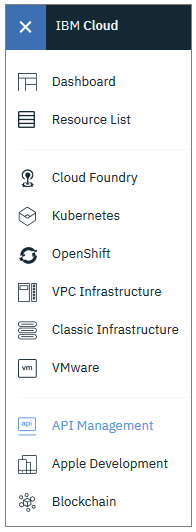

---

copyright:
  years: 2018, 2019
lastupdated: "2019-11-30"

keywords: IBM Cloud, API Gateway, API Gateway Lite, API management, API, manage, share, gateway, Cloud Foundry, App Connect, Cloud Functions, consume, key, explore

subcollection: api-gateway

---

{:external: target="_blank" .external} 
{:shortdesc: .shortdesc}
{:screen: .screen}
{:codeblock: .codeblock}
{:pre: .pre}
{:note: .note}

# Using a shared API
{: #consume_api}

Work with an API that is shared with you.
{: shortdesc}

## Overview
{: #overview-consume_api}

Other {{site.data.keyword.cloud_notm}} developers might share their managed APIs with you in the {{site.data.keyword.apigw_short}} service or the Legacy {{site.data.keyword.apigw_short}}. 

To see which APIs have been shared with you, complete the following steps:

1. [Log in](https://cloud.ibm.com/login/){: external} to {{site.data.keyword.cloud_notm}}.
  
2. On the Dashboard, click  and select **API Management**.

  
  
3. In the navigation list, expand **API Gateway** and click **Shared APIs**.

The "Shared APIs" page displays a list of all of the APIs that were shared with you.

## Viewing API details
{: #details-consume_api}

For each API, the display lists the API's name, endpoint URL, and the number of API keys assigned to the API.

To see more information about the API, click the API's row in the list to display the "API Summary" page.

The "API Summary" page displays details such as the API's security settings, and sharing status. In addition, you can review analytics information and logging records for the past hour.

## Creating API keys for a shared API
{: #keys-consume_api}

To call a shared API, you must include an API key in the request header. If the API requires a secret, include that as well. Use the following parameter names for the keys:

- API key: `X-IBM-Client-Id`

- API secret: `X-IBM-Client-Secret`

To create the API key, complete the following steps:

1. Navigate to the "API Summary" page for the API that you want to use, and click **Create API key**.

2. In the "Create API key" dialog box, provide the following settings:

   - **Descriptive name** A display name for the API key; for example, the name of the company that you are creating the key for. Naming API keys lets you track individual keys; for example, in the usage information that displays in the API summary. 

     Allowed characters are: A-Z a-z 0-9 - _ (no spaces allowed)

    - API key: Select **Use generated key** if you want a value created for you. Select **Specify key** to create your own value.

    - API secret: If the API's creator specified that an API secret is required, a value is generated now and displayed in the **API secret** field. 

     * Click **Show** to display the value.

     * Optionally delete the value and type a new one. Type the same value in the **Verify API secret** field.

    Copy the secret and save it so that you can use it later for testing. After you close this dialog box, you cannot access the secret again. If you lose the secret, you must create a new one.
{: important}

3. Click **Create** to generate and save the API key (and secret).

## Testing a shared API
{: #explore-consume_api}

You can explore and try an API that was shared with you. In the navigation list, expand **API Gateway** and click **API Explorer**.

The API Explorer shows the details of the OpenAPI definition; for example, the response schema and the available operations. You can download the OpenAPI definition to reuse it.

To test the API, select a programming language to use for the API call. The examples detail the request and response for the selected language so you can see how the API works. When you're ready to invoke the API, click **Try it**.

For more information on testing an API in the API Explorer, see [Viewing and testing an API](/docs/api-gateway?topic=api-gateway-test_api). 
