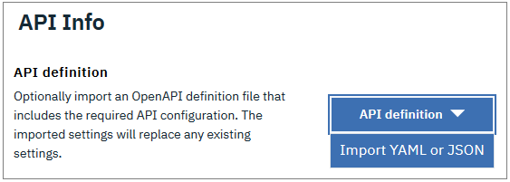
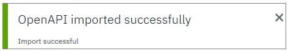
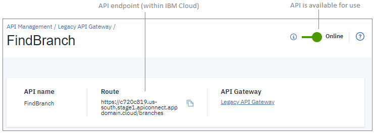

---

copyright:
  years: 2018, 2020
lastupdated: "2020-08-07"

keywords: IBM Cloud, API Gateway, API Gateway Lite, API management, API, gateway, develop, create, proxy, Cloud Foundry, App Connect, Cloud Functions

subcollection: api-gateway

---

{:external: target="_blank" .external} 
{:shortdesc: .shortdesc}
{:screen: .screen}
{:codeblock: .codeblock}
{:pre: .pre}
{:note: .note}

# Creating an API
{: #create_api}

Create APIs and API proxies that you can use with {{site.data.keyword.cloud_notm}} applications.
{: shortdesc}

## Overview
{: #overview-create_api}

APIs can be secured by IAM resource groups or Cloud Foundry spaces. 

- IAM Resource group

  A resource group organizes your account resources in customizable groupings so that you can quickly assign users access to more than one resource at a time. Identity and Access Management services control both access to resources, and the set of actions that can be performed by users.
  
  Use the {{site.data.keyword.apigw_short}} service to create API proxies and {{site.data.keyword.openwhisk_short}} APIs in resource groups.

- Cloud Foundry space

  A space provides users with access to a shared location for app development, deployment, and maintenance. Cloud Foundry roles grant access to spaces, but offer no control over user actions. 
  
  You can manage Cloud Foundry APIs as well as create API proxies, {{site.data.keyword.openwhisk_short}} APIs, and {{site.data.keyword.appconserviceshort}} APIs in Cloud Foundry spaces. 
  
  Use the Legacy {{site.data.keyword.apigw_short}} to work with APIs in Cloud Foundry spaces.

  
## Create an API proxy 
{: #proxy-create_api}

 Available in {{site.data.keyword.apigw_short}} and Legacy {{site.data.keyword.apigw_short}}.

Create a managed API that proxies an external REST API. An API proxy defines configuration settings for an external API that you want to use in {{site.data.keyword.cloud_notm}}. To proxy an API, you provide the URL of its endpoint and optionally define security settings. Create the proxy to use the external API within {{site.data.keyword.cloud_notm}} without disrupting current users.

1. Decide whether to create the API proxy in an IAM resource group or a Cloud Foundry space, and start the appropriate service:

  - IAM resource group: {{site.data.keyword.apigw_short}} service
  
    The API proxy is bound to the resource group that you selected when you provisioned the {{site.data.keyword.apigw_short}} service.
  
  - Cloud Foundry space: Legacy {{site.data.keyword.apigw_short}}

2. Click **Create an API Proxy**.

3. On the "Create API Proxy" page, complete the fields to configure a proxy so that the external API can be called by IBM Cloud apps. 

   Related fields are grouped into sections on the page.

**API Info** section:

- **API definition**

  If you want to provide the API name, base path, and URL manually then skip this field. 
  
  If you want to import an OpenAPI definition file, complete the following steps:
  
  
  
  a. Click **API definition** and select **Import YAML or JSON**. 
  
  b. Locate the file on your computer, select it, and click **Open**.
  
  c. When you see the "OpenAPI imported successfully" message, skip to the "Security and Rate Limiting" section and complete the remaining fields on the page.
  
    

- **API basics**

  The "API basics" fields must be completed.
  
  If you imported the API definition, the values for "API basics" fields are extracted from the definition file. You can optionally edit the values and save the updated definition.
  
  * **Name**: Type a brief name that can be used to identify the API. The name must be unique within the Cloud Foundry space.

  * **Base path for API**: The base path is appended to the API's endpoint to create its target URL. The default value is based on the API name, but you can change it as needed. The base path cannot include special characters.
  
- External endpoint

  Provide the **URL of external endpoint** where the new API proxy routes traffic from {{site.data.keyword.cloud_notm}}.

**Security and Rate Limiting** section:

If you choose not to secure the API now, you can edit the definition and add security settings at any time.
{: tip}

- **Application authentication**

  Optionally require authentication with the API key only, or with both the API key and the API secret. If you intend to enable rate-limiting for your API, you must enable application authentication so that the limit can be tracked for each calling application based on the API key.

  * **Require application authentication via API key**: Click  to enable this option if you want to require apps that call your API to authenticate with an API key, or with a combination of an API key and an API secret.
    
  * **Method**: Select **API key only** or **API key and secret**.
  
  * **Location of API key and secret**: The calling app must include the API key (and secret, if you selected it) in the request header. 
  
  * **Parameter name of API key**: {{site.data.keyword.cloud_notm}} requires the following parameter name for the API key: `X-IBM-Client-Id`.
  
  * **Parameter name of API secret**: {{site.data.keyword.cloud_notm}} requires the following parameter name for the API secret: `X-IBM-Client-Secret`.

- **Rate Limiting**

  * **Limit API call rate on a per-key basis**: Click  to enable this option if you want to reject API calls that exceed the limit within the specified period. The rate-limit is applied separately to each API key. If you enable rate-limiting, then you must enable application authentication to ensure that API keys can be tracked.
  
  * **Maximum calls**: Type or select the maximum number of calls to allow within a time period. This field must contain a value greater than `0`.
  
  * **Unit of time**: Select the unit of time for applying rate limits; each application is allowed the maximum number of calls within the selected time period.

- **OAuth user authentication**

  * **Require users to authenticate via OAuth social login**: Click  to enable this option if you want to require user to sign in to an external application before they invoke the API. 

  * Select the external application in the **Provider** field. 

  The app that invokes the API must include a token from the the provider in the request header. If the token cannot be validated with the social app, the response returns the HTTP status code 401 for an unauthorized request.

  * **App ID service**: If you selected {{site.data.keyword.appid_full_notm}} as the OAuth provider, select your own App ID service instance as the token provider. When a user is successfully authenticated, the application receives a token from App ID. 
  
    If you do not have an {{site.data.keyword.appid_full_notm}} service instance, click  to create your service in a new browser tab. Then, return to the "Create API Proxy" page and refresh your browser. The new service's name displays in the **App ID service** field. 
  
    If you already have an {{site.data.keyword.appid_full_notm}} service instance but are not sure of its settings, click  to open the service information in a new browser tab.
    {: tip}
  
- **CORS**

  Enable CORS (Cross-Origin Resource Sharing) support so that the API can be accessed from another domain. When the API is called from a web page that is hosted in another domain, the response must include a CORS header.
  
  CORS support is enabled by default but you can select **Disable CORS** in the **CORS status** field if you prefer not to use CORS headers.

**IBM Cloud Settings** section:

- **API Gateway**

  This field indicates which API gateway is used to create and manage the API proxy:
  
  - **Legacy {{site.data.keyword.apigw_short}}** is used for APIs and API proxies that are secured by Cloud Foundry spaces.
  
    If you started the Legacy {{site.data.keyword.apigw_short}} before you created the API proxy definition, that gateway is used by default. 
	
	If you want to create and manage the API proxy with the {{site.data.keyword.apigw_short}} service instead, click **Cancel** > **Discard changes**. Then, open the [API Management overview page](https://cloud.ibm.com/apis/overview){: external}, look in the "API Gateway" section, and click "Create an API Proxy" to create the service when you define the API proxy.
    {: tip}
  
  - **{{site.data.keyword.apigw_short}} service** is used for APIs and API proxies that are secured by IAM resource groups.
  
    If you did not create an {{site.data.keyword.apigw_short}} service already, you can provision it now. A default name and resource group are provided for you. Click "Customize" if you want to modify the settings.

- **Location**
  
  Select the cloud region where you want to host the API. Typically, you can expect better performance if you host the API geographically close to the back-end application.
  
  If you are using the Legacy {{site.data.keyword.apigw_short}} to create an API proxy in a Cloud Foundry space, you must additionally indicate where that space is hosted:

  * **Cloud Foundry organization**: Select the organization that owns the Cloud Foundry space that secures the API or API proxy.
  
  * **Cloud Foundry space**: Select the space where you want to create the API or API proxy.

4. Click **Create**.

  When the new API proxy is ready, information about it displays on the "Summary" page. In particular, the summary provides the API endpoint and a status indicator (when the API is "online" it is available for use).

  

## Create a {{site.data.keyword.openwhisk_short}} API
{: #cfunc-create_api}

 Available in {{site.data.keyword.apigw_short}} and Legacy {{site.data.keyword.apigw_short}}.

Create an API that calls a {{site.data.keyword.openwhisk_short}} action. When you select this option, the {{site.data.keyword.openwhisk_short}} "API" page displays. Define the API in {{site.data.keyword.openwhisk_short}}, and then return to {{site.data.keyword.apigw_short}} or Legacy {{site.data.keyword.apigw_short}} to manage the API.

For more information about working with {{site.data.keyword.openwhisk_short}}, see [Getting started with IBM Cloud Functions](/docs/openwhisk?topic=cloud-functions-getting-started).

 Before you begin: Create one or more actions in {{site.data.keyword.openwhisk_short}}.

1. Decide whether you want to create the API in an IAM resource group or a Cloud Foundry space, and start the appropriate service:

  - IAM resource group: {{site.data.keyword.apigw_short}} service
  
    Because you create the API in {{site.data.keyword.openwhisk_short}}, it is not automatically bound to the resource group used for the {{site.data.keyword.apigw_short}} service. Your {{site.data.keyword.apigw_short}} service can manage Cloud Functions APIs that belong to different resource groups.
  
  - Cloud Foundry space: Legacy {{site.data.keyword.apigw_short}}

2. Click **Create a {{site.data.keyword.openwhisk_short}} API**.

   The {{site.data.keyword.openwhisk_short}} "APIs" page displays.
  
3. On the "APIs" page, click **Create API**. 

4. On the "Create a {{site.data.keyword.openwhisk_short}} API" page, complete the fields to define an API that invokes {{site.data.keyword.openwhisk_short}} actions. 

  Related fields are grouped into sections on the page.

**API Info** section:

- **API definition**

  If you want to provide the API name, base path, and URL manually then skip this field. 
  
  If you want to import an OpenAPI definition file, complete the following steps:
  
  

  a. Click **API definition** and select **Import YAML or JSON**. 
  
  b. Locate the file on your computer, select it, and click **Open**.
  
  c. Skip to the "Security and Rate Limiting" section and complete the remaining fields on the page.
  
    

- **API basics**

  The "API basics" fields must be completed.
  
  If you imported the API definition, the values for "API basics" fields are extracted from the definition file. You can optionally edit the values and save the updated definition.
  
  * **Name**: Type a brief name that can be used to identify the API. The name must be unique within the Cloud Foundry space.

  * **Base path for API**: The base path is appended to the API's endpoint to create its target URL. The default value is based on the API name, but you can change it as needed. The base path cannot include special characters.
  
- **Operations**

  Click **Create operation** and to define the endpoint, HTTPS path, and method for your API. You can create multiple operations for a single API. 

  In the "Create Operation" window, complete the required fields for your {{site.data.keyword.openwhisk_short}} operation and then click **Create**:

  - **Path**: The path to where your API is located. 
  
  - **Verb**: Select the HTTP method for your API. 
  
  - **Package containing action**: Select the {{site.data.keyword.openwhisk_short}} package that contains the actions that you want to use for this API.
  
  - **Actions**: The only option is **Actions that are available in {{site.data.keyword.cloud_notm}}**.
	
  - **Response content type**: Select the format to use for returning responses to the calling app. Table 1 describes the available response formats.
	
| Response format | Description |
| --------------- | ----------- |
| `application/json` | The default format, returns data in JSON format. |
| `text/html` | Returns data that is formatted as HTML for use on a web page. |
| `text/plain` | Returns plain text, which can optionally be used in comma-separated values (CSV) files. |
| `image/svg+xml` | Returns an encoded image. |
| `Use "Content-Type" header from action` | Returns data in the format that is specified in the response header. |
{: caption="Table 1. Response format options" caption-side="top"}

**Security and Rate Limiting** section:

If you choose not to secure the API now, you can edit the definition and add security settings at any time.
{: tip}

- **Application authentication**

  Optionally require authentication with the API key only, or with both the API key and the API secret. If you intend to enable rate-limiting for your API, you must enable application authentication so that the limit can be tracked for each calling application based on the API key.

  * **Require application authentication via API key**: Click  to enable this option if you want to require apps that call your API to authenticate with an API key, or with a combination of an API key and an API secret.
  
  * **Method**: Select **API key only** or **API key and secret**.
  
  * **Location of API key and secret**: The calling app must include the API key (and secret, if you selected it) in the request header. 
  
  * **Parameter name of API key**: {{site.data.keyword.cloud_notm}} requires the following parameter name for the API key: `X-IBM-Client-Id`.
  
  * **Parameter name of API secret**: {{site.data.keyword.cloud_notm}} requires the following parameter name for the API secret: `X-IBM-Client-Secret`.

- **Rate Limiting**

  * **Limit API call rate on a per-key basis**: Click  to enable this option if you want to reject API calls that exceed the limit within the specified period. The rate-limit is applied separately to each API key. If you enable rate-limiting, then you must enable application authentication to ensure that API keys can be tracked.
  
  * **Maximum calls**: Type or select the maximum number of calls to allow within a time period. This field must contain a value greater than `0`.
  
  * **Unit of time**: Select the unit of time for applying rate limits; each application is allowed the maximum number of calls within the selected time period.

- **OAuth user authentication**

  * **Require users to authenticate via OAuth social login**: Click  to enable this option if you want to require user to sign in to an external application before they invoke the API. 

  * Select the external application in the **Provider** field. 

  The app that invokes the API must include a token from the the provider in the request header. If the token cannot be validated with the social app, the response returns the HTTP status code 401 for an unauthorized request.

  * **App ID service**: If you selected {{site.data.keyword.appid_full_notm}} as the OAuth provider, select your own {{site.data.keyword.appid_full_notm}} service instance as the token provider. When a user is successfully authenticated, the application receives a token from App ID. 
  
    If you do not have an {{site.data.keyword.appid_full_notm}} service instance, click  to create your service in a new browser tab. Then, return to the "Create API Proxy" page and refresh your browser. The new service's name displays in the **App ID service** field. 
  
    If you already have an {{site.data.keyword.appid_full_notm}} service instance but are not sure of its settings, click  to open the service information in a new browser tab.
    {: tip}
  
- **CORS**

  Enable CORS (Cross-Origin Resource Sharing) support so that the API can be accessed from another domain. When the API is called from a web page that is hosted in another domain, the response must include a CORS header.
    
  CORS support is enabled by default but you can select **Disable CORS** in the **CORS status** field if you prefer not to use CORS headers.

**IBM Cloud Settings** section:

- **API Gateway**

  This field indicates which API gateway is used to create and manage the API proxy:
  
  - **Legacy {{site.data.keyword.apigw_short}}** is used for APIs and API proxies that are secured by Cloud Foundry spaces.
  
    If you started the Legacy {{site.data.keyword.apigw_short}} the API proxy definition, that gateway is used by default. 
	
	If you want to create and manage the API proxy with the {{site.data.keyword.apigw_short}} service instead, click **Cancel** > **Discard changes**. Then, open the [API Management overview page](https://cloud.ibm.com/apis/overview){: external}, look in the "API Gateway" section, and click "Create an API Proxy" -- you can create the service when you define the API proxy.
    {: tip}
  
  - **{{site.data.keyword.apigw_short}} service** is used for APIs and API proxies that are secured by IAM resource groups.
  
    If you did not start the Legacy {{site.data.keyword.apigw_short}}, the {{site.data.keyword.apigw_short}} is used by default. If you not create an {{site.data.keyword.apigw_short}} service already, you can provision it now. A default name and resource group are provided for you; click "Customize" if you want to modify those settings before creating the service.

- **Location**
  
  Select the cloud region where you want to host the API. Typically, you can expect better performance if you host the API geographically close to the back-end application.
  
  If you are using the Legacy {{site.data.keyword.apigw_short}} to create an API proxy in a Cloud Foundry space, you must additionally indicate where that space is hosted:

  * **Cloud Foundry organization**: Select the organization that owns the Cloud Foundry space that secures the API or API proxy.
  
  * **Cloud Foundry space**: Select the space where you want to create the API or API proxy.

4. Click **Create**.

  When the new API is ready, the "API Summary" page displays information about the new API. In particular, the summary provides the API endpoint and a status indicator (when the API is "online" it is available for use).

  

## Manage an API exposed by a Cloud Foundry application
{: #cfdry-create_api}

 Available in Legacy {{site.data.keyword.apigw_short}} only.

Add an API to a Cloud Foundry app and then manage it with the Legacy {{site.data.keyword.apigw_short}}. 

If you already added APIs to your Cloud Foundry app, you can locate them on the "Managed APIs" page in the Legacy {{site.data.keyword.apigw_short}} and work with them there.
{: tip}

 Before you begin: Create an application in the Cloud Foundry "Public" environment.

1. Start your Cloud Foundry service and open your app.

2. In the navigation list, click **API Management**.

   In the "API Management for IBM Cloud" section of the page, click **Get Started**.

3. On the app page, complete the fields to define an API that can be managed by the Legacy {{site.data.keyword.apigw_short}}. 

  Related fields are grouped into sections on the page.

**API Info** section:

- **API definition**

  If you want to provide the API name, base path, and URL manually then skip this field. 
  
  If you want to import an OpenAPI definition file, complete the following steps:
  
  
  
  a. Click **API definition** and select **Import YAML or JSON**. 
  
  b. Locate the file on your computer, select it, and click **Open**.
  
  c. Skip to the "Security and Rate Limiting" section and complete the remaining fields on the page.
  
    

- **API basics**
  
  * **Name**: Type a brief name that can be used to identify the API. The name must be unique within the Cloud Foundry space. If you imported the API definition, the name is extracted from the definition file.

**Security and Rate Limiting** section:

If you choose not to secure the API now, you can edit the definition and add security settings at any time.
{: tip}

- **Application authentication**

  Optionally require authentication with the API key only, or with both the API key and the API secret. If you intend to enable rate-limiting for your API, you must enable application authentication so that the limit can be tracked for each calling application based on the API key.

  * **Require application authentication via API key**: Click  to enable this option if you want to require apps that call your API to authenticate with an API key, or with a combination of an API key and an API secret.
  
  * **Method**: Select **API key only** or **API key and secret**.
  
  * **Location of API key and secret**: The calling app must include the API key (and secret, if you selected it) in the request header. 
  
  * **Parameter name of API key**: {{site.data.keyword.cloud_notm}} requires the following parameter name for the API key: `X-IBM-Client-Id`.
  
  * **Parameter name of API secret**: {{site.data.keyword.cloud_notm}} requires the following parameter name for the API secret: `X-IBM-Client-Secret`.

- **Rate Limiting**

  * **Limit API call rate on a per-key basis**: Click  to enable this option if you want to reject API calls that exceed the limit within the specified period. The rate-limit is applied separately to each API key. If you enable rate-limiting, then you must enable application authentication to ensure that API keys can be tracked.
  
  * **Maximum calls**: Type or select the maximum number of calls to allow within a time period. This field must contain a value greater than `0`.
  
  * **Unit of time**: Select the unit of time for applying rate limits; each application is allowed the maximum number of calls within the selected time period.

- **OAuth user authentication**

  * **Require users to authenticate via OAuth social login**: Click  to enable this option if you want to require user to sign in to an external application before they invoke the API. 

  * Select the external application in the **Provider** field. 

  The app that invokes the API must include a token from the the provider in the request header. If the token cannot be validated with the social app, the response returns the HTTP status code 401 for an unauthorized request.

  * **App ID service**: If you selected {{site.data.keyword.appid_full_notm}} as the OAuth provider, select your own {{site.data.keyword.appid_full_notm}} service instance as the token provider. When a user is successfully authenticated, the application receives a token from App ID. 
  
    If you do not have an {{site.data.keyword.appid_full_notm}} service instance, click  to create your service in a new browser tab. Then, return to the "Create API Proxy" page and refresh your browser. The new service's name displays in the **App ID service** field. 
  
    If you already have an {{site.data.keyword.appid_full_notm}} service instance but are not sure of its settings, click  to open the service information in a new browser tab.
    {: tip}
  
- **CORS**

  Enable CORS (Cross-Origin Resource Sharing) support so that the API can be accessed from another domain. When the API is called from a web page that is hosted in another domain, the response must include a CORS header.
  
  CORS support is enabled by default but you can select **Disable CORS** in the **CORS status** field if you prefer not to use CORS headers.

**IBM Cloud Settings** section:

- **API Gateway**

  This field indicates that the Legacy {{site.data.keyword.apigw_short}} secures be used to manage the API.
    
- **Location**
  
  Select the cloud region where you want to host the API. Typically, you can expect better performance if you host the API geographically close to the back-end application.
  
  The API is created in the current Cloud Foundry organization and Cloud Foundry space.

4. Click **Save**.

  When the new API is ready, Cloud Foundry displays the Legacy {{site.data.keyword.apigw_short}} pages where you can review and manage the new API.

5. On the "Summary" page, click **Expose Managed API** to set the API online so that it can be used.

   When you expose the API, the endpoint displays in the **Route** field. For information on how you can manage the API, see the other topics in this documentation set.

## Create an API with App Connect
{: #appc-create_api}

Create an API flow in {{site.data.keyword.appconserviceshort}} and then manage it with the Legacy {{site.data.keyword.apigw_short}}. 

If you already created APIs in {{site.data.keyword.appconserviceshort}}, you can locate them on the "Managed APIs" page in the Legacy {{site.data.keyword.apigw_short}} and work with them there.
{: tip}

 Available in Legacy {{site.data.keyword.apigw_short}} only.

 Before you begin: Provision an instance of the {{site.data.keyword.appconserviceshort}} service.

1. Start your A{{site.data.keyword.appconserviceshort}} service.

   The {{site.data.keyword.appconserviceshort}} dashboard opens to the "Define" page and displays any existing API flows. You can manage existing API flows and create new flows.

2. Click **New** > **Flows for an API** and create a new API flow.

3. After you save the API, click **Start** to set it online so that it can be used.

   When the API is ready to use, its status displays as "Running".

4. Click **Manage** to open the API management page.

   The "Manage" page displays the Legacy {{site.data.keyword.apigw_short}} pages where you can review and manage the new API.

5. On the "Summary" page, click **Expose Managed API** to set the API online so that it can be used.

   When you expose the API, its endpoint displays in the **Route** field. For information on how you can manage the API, see the other topics in this documentation set.
