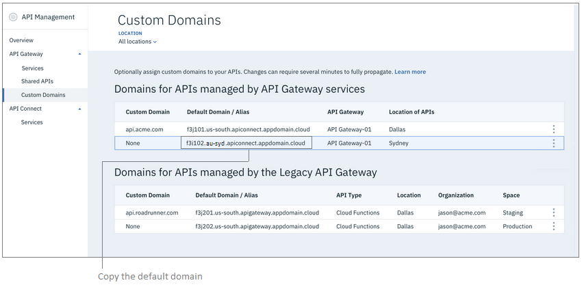
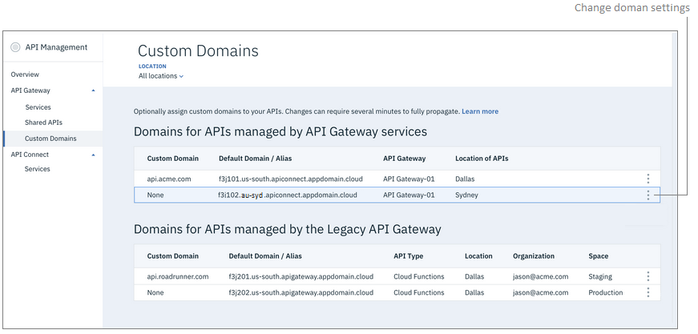
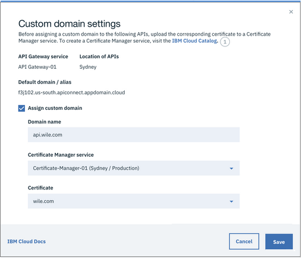
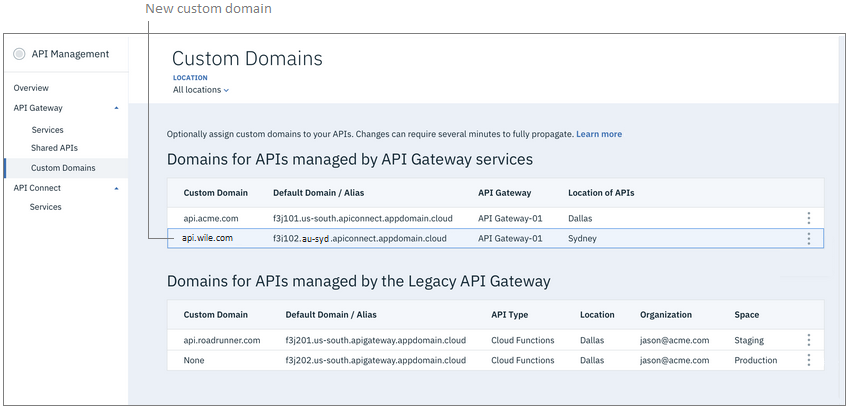

---

copyright:
  years: 2018, 2019
lastupdated: "2019-11-30"

keywords: IBM Cloud, API Gateway, API Gateway Lite, API management, API, manage, gateway, endpoint, target, path, custom, vanity, personal, domain, DNS, CNAME, TXT

subcollection: api-gateway

---

{:external: target="_blank" .external} 
{:shortdesc: .shortdesc}
{:screen: .screen}
{:codeblock: .codeblock}
{:pre: .pre}
{:note: .note}
{:tip: .tip}

# Customizing the domain for an API endpoint
{: #custom_endpoint}

Create a custom domain and map it to the default {{site.data.keyword.cloud_notm}} domain that is used in the URL for API endpoints. All APIs that use that endpoint will be bound to the custom domain.
{: shortdesc}

## Overview
{: #overview-custom_endpoint}

Using a custom domain (sometimes called a vanity domain) enables you to present an API with your own branding. By default, an API or API proxy created in {{site.data.keyword.apigw_short}} or Legacy {{site.data.keyword.apigw_short}} uses an endpoint with the {{site.data.keyword.cloud_notm}} domain. You can configure the API to use a custom domain in the endpoint URL, so that API requests are directed to your own domain.

If you host your app in multiple {{site.data.keyword.cloud_notm}} regions, you can customize the domain in each region.

Configuring the custom domain for the API endpoint involves two tasks:

1. Prepare your domain to be used as an API endpoint.

2. Customize the default domain in {{site.data.keyword.cloud_notm}} to point to your own domain.

## Step 1. Prepare your domain for use as an API endpoint
{: #prep_domain-custom_endpoint}

Before you can assign your domain to an API endpoint, you must secure the domain with TLS and set up host name with your DNS provider.

### Secure your domain with TLS
{: #secure_domain-custom_endpoint}

In {{site.data.keyword.cloud_notm}}, API invocations must be secured with TLS and use `https` in the endpoint. Unsecured endpoints (using `http`) are not supported.

Use the [{{site.data.keyword.cloudcerts_long}}](/docs/certificate-manager?topic=certificate-manager-getting-started){: external} service to upload your domain's certificate and private key so they can be used with your APIs.

### Update DNS settings for your domain
{: #dns_domain-custom_endpoint}

Update the DNS settings for your domain to map it to the default {{site.data.keyword.cloud_notm}} domain. Mapping the domains in your DNS ensures that your app can direct responses to API requests back to {{site.data.keyword.cloud_notm}}.

1. Copy the {{site.data.keyword.cloud_notm}} default domain.

  a. Log in to {{site.data.keyword.cloud_notm}} and open the [API Management page](https://cloud.ibm.com/apis/overview){: external}.
  
  b. In the navigation list, click **API Gateway** > **Custom Domains**.

     You do not need to start your gateway service to complete this task.
{: tip}

     The "Custom Domains" page lists all of the domains used by your APIs, sorted by gateway. 

    

  c. On the "Custom Domains" page, copy the **Default Domain / Alias** value from the domain that you want to customize.

2. Update your domain's DNS settings to map your domain to the  default domain that you just copied.

   For information on updating DNS settings for your domain, refer to your DNS provider documentation.

   a. Create a TXT record for the domain with the following settings: 

      - Set the `host` field to the your custom domain (for example, `api.acme.com`). 
   
      - Set the `value` field to the **Default Domain / Alias** value, which you copied in step 1-c.
   
   b. Create a CNAME record pointing your custom domain (for example, `api.mycompany.com`) to the **Default Domain / Alias** value. 
   
      The CNAME record routes traffic from your domain back to your back-end API.
  
   Allow up to 48 hours for the DNS changes to propagate. If you attempt to customize the default API endpoint before the DNS propagation is complete, the DNS validation will fail.
	 

## Step 2. Map your domain to the default domain in {{site.data.keyword.cloud_notm}}
{: #assign_domain-custom_endpoint}

Mapping the domains in the gateway service ensures that API requests can be forwarded to your custom domain.

1. Log in to {{site.data.keyword.cloud_notm}} and open the [API Management page](https://cloud.ibm.com/apis/overview){: external}.
  
2. In the navigation list, click **API Gateway** > **Custom Domains**.

   You do not need to start your gateway service to complete this task.
{: tip}

   The "Custom Domains" page lists all of the domains used by your APIs, sorted by gateway. 

  

3. In the list, click  next to the domain that you want to customize.

  The "Custom domain settings" dialog box displays with the URL of the selected default domain and the name of the associated gateway service. 
  
4. In the "Custom Domain Settings" dialog box, select **Assign custom domain** and complete the following fields:

  

  - **Domain name**: Type the custom domain that will replace the default endpoint.
  
  - **Certificate Manager** service: Select the {{site.data.keyword.cloudcerts_long}} service where you uploaded the certificate for your custom domain.
  
  - **Certificate**: Select the certificate that secures your custom domain.
  
5. Click **Save**.

   The new custom domain name displays next to the default domain.
   
   

6. Wait while the custom domain is verified.

  The gateway service verifies the custom domain by checking the mapping in the DNS provider's TXT record. If the DNS mapping has not propagated, or if the TXT record is incorrect, an error message appears and your custom endpoint settings are canceled. Ensure that 48 hours have elapsed since the DNS update before trying again.
  
  If the error persists longer than 48 hours and you do not see any mistakes in the TXT record where you mapped the domains, contact {{site.data.keyword.cloud_notm}} Support for assistance.
