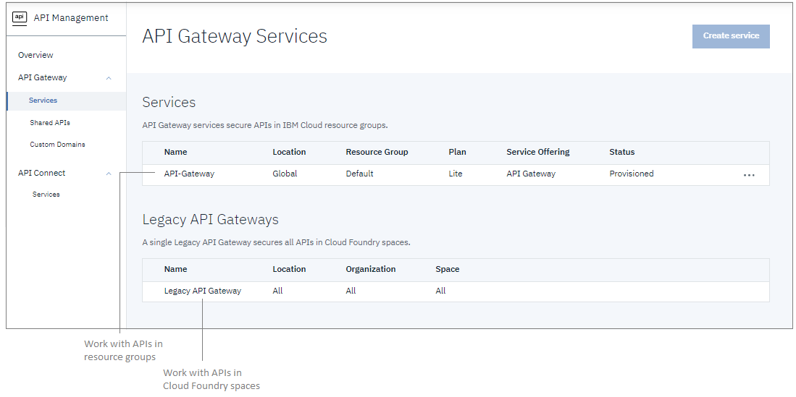
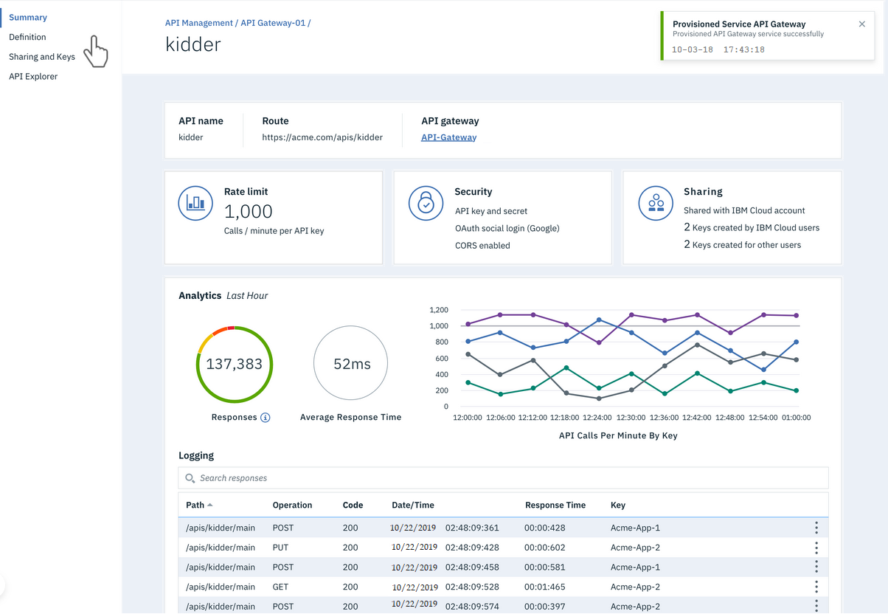
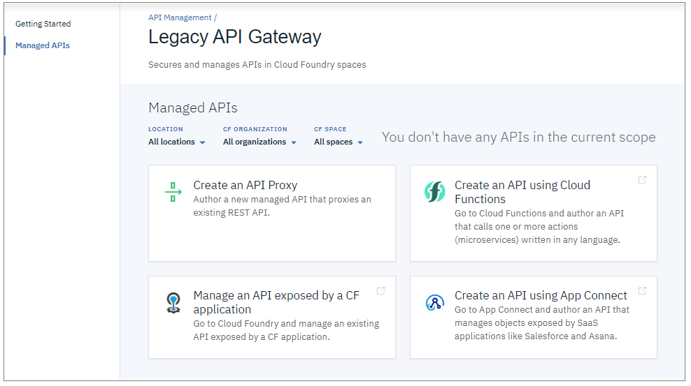

---

copyright:
  years: 2018, 2019
lastupdated: "2019-11-30"

keywords: IBM Cloud, API Gateway, legacy API Gateway, API management, API, manage, share, gateway, develop, create, proxy, Cloud Foundry, App Connect, Cloud Functions

subcollection: api-gateway

---

{:external: target="_blank" .external} 
{:shortdesc: .shortdesc}
{:screen: .screen}
{:codeblock: .codeblock}
{:pre: .pre}
{:note: .note}

# Getting started
{: #getting-started}

Create, secure, and share API proxies and APIs backed by {{site.data.keyword.cloud_notm}} resources.
{: shortdesc}

Use {{site.data.keyword.apigw_full}} to manage APIs natively in {{site.data.keyword.Bluemix}}. You can manage APIs that are associated with a Cloud Foundry runtime, a {{site.data.keyword.openwhisk_short}} action, or an integrated {{site.data.keyword.cloud_notm}} service such as {{site.data.keyword.appconserviceshort}}. Manage your APIs to control usage, increase adoption, and track statistics.

If you previously created and managed APIs with the Legacy {{site.data.keyword.apigw_short}} (through the {{site.data.keyword.cloud_notm}} API Management dashboard), all of those features are still supported. For information about what's new, see [{{site.data.keyword.apigw_short}} service and Legacy API Gateway](/docs/api-gateway?topic=api-gateway-whatis_apigw-compare#whatis_apigw-compare).
{: note}

Ready to start managing APIs with the {{site.data.keyword.apigw_full}} service?

## Step 1. Start your {{site.data.keyword.apigw_short}} service or Legacy {{site.data.keyword.apigw_short}}
{: #start-service_getting-started}

1. [Log in](https://cloud.ibm.com/login/){: external} to {{site.data.keyword.cloud_notm}}.
  
2. On the Dashboard, click  and select **API Management**.

  

3. In the navigation list, expand **API Gateway** and click **Services**.

   

   The "Services" page lists all of your API Gateways services. If you have not created an {{site.data.keyword.apigw_short}} yet, you can create it now by clicking **Create Service**.

   The Legacy API Gateway is available to all users without provisioning a service instance.

4. On the "Services" page, click your service instance name to start it.

   The service opens directly to the "Managed APIs" page and your service name displays on the page. 
   
   - {{site.data.keyword.apigw_short}} service

     The "Managed APIs" page displays the name of the current resource group, any APIs that you manage in the resource group, and options to create new APIs.
   
       

   - Legacy {{site.data.keyword.apigw_short}}

     Displays the name of the current Cloud Foundry space, any APIs that you manage in the space, and options to create and manage new APIs. 
   
       

## Step 2. Create an API
{: #create-api_getting-started}

An API proxy defines configuration settings for an external API so that you can call it from {{site.data.keyword.cloud_notm}} apps. 
Creating an API proxy is the same process for all gateways; the gateway that you selected on the "Services" page is used for creating the API proxy. 

1. Click **Create an API Proxy**.

2. On the "Create API Proxy" page, complete the fields to configure a proxy.

   For information on the available configuration settings for the new API proxy, see [Create an API proxy](/docs/api-gateway?topic=api-gateway-proxy-create_api).

3. Click **Create**.

When the new API proxy is ready, information about it displays on the "Summary" page. In particular, the summary provides the API endpoint and a status indicator (when the API is "online" it is available for use).

## Step 3. Share your API with other developers
{: #share-api_getting-started}

You can share an API with an external developer by creating an API key and sending it to the developer. You can create up to 5 API keys for each API.

1. In the navigation list, click **Managed APIs**.

3. On the "Managed APIs" page, click the name of the API that you want to share.

4. In the navigation list, click **Sharing and Keys**. 

5. On the "Sharing and Keys" page, verify that the API is online so that it can be shared.

   

6. In the "Sharing Outside of {{site.data.keyword.cloud_notm}}" section, click **Create API key** to generate a new key for the API.

   The new API key and a corresponding "API Documentation Link" display. 

7. Add a name to identify the key; for example, the name of the developer that you want to share it with. 

8. Copy the API Documentation Link and send it to the external user. 

   The link opens the API Explorer for the API so that the external user can read the API documentation and test the API.

For more information about sharing APIs with other developers, see [Sharing an API](/docs/api-gateway?topic=api-gateway-share_api).

## Next steps
{: #next_steps_getting-started}

For more information about {{site.data.keyword.apigw_short}} features, see [What is {{site.data.keyword.apigw_short}}?](/docs/api-gateway?topic=api-gateway-whatis_apigw)

If you're ready to get to work, see the topics in the HOW TO section for information on [creating](/docs/api-gateway?topic=api-gateway-create_api), [sharing](/docs/api-gateway?topic=api-gateway-share_api), and [managing](/docs/api-gateway?topic=api-gateway-manage_api) APIs.

Looking for information about the full set of API lifecycle features available in {{site.data.keyword.apigw_short}}? 

- Review the [IBM Knowledge Center documentation](https://www.ibm.com/support/knowledgecenter/en/SSMNED_cloud/mapfiles/getting_started_ibmcloud.html){: external} for the Reserved Instance edition of {{site.data.keyword.apigw_short}}.
- Check out our [hands-on labs](https://www.ibm.com/cloud/garage/dte/tutorial/apic-dev-jam-series-lab-1-create-and-secure-api/){: external}. You can request to try out the complete set of API lifecycle management capabilities for up to a week.

